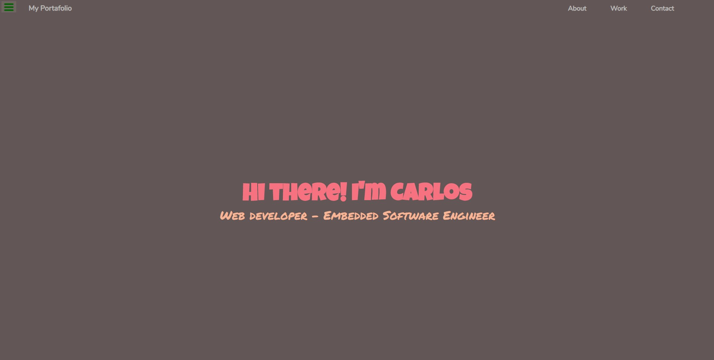
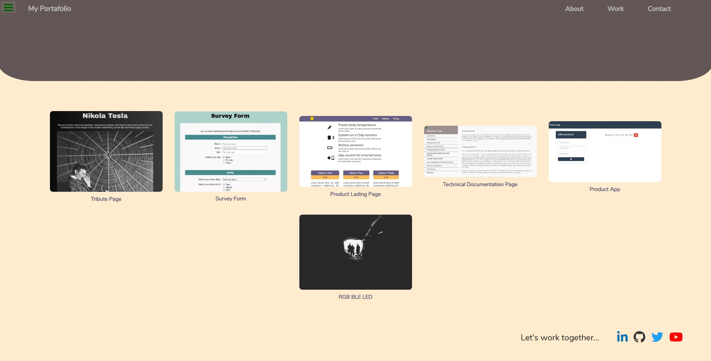

# FreeCodeCamp - Personal Portfolio Webpage
This is part of Free Code Camp curriculum, Responsive Web Design Projects section - Personal Portfolio Webpage.

You can see the project page in [freeCodeCamp](https://learn.freecodecamp.org/responsive-web-design/responsive-web-design-projects/build-a-personal-portfolio-webpage/),
also you can view it in [codepen](https://codepen.io/xinthauro/full/pqowPY).

## Screenshots

